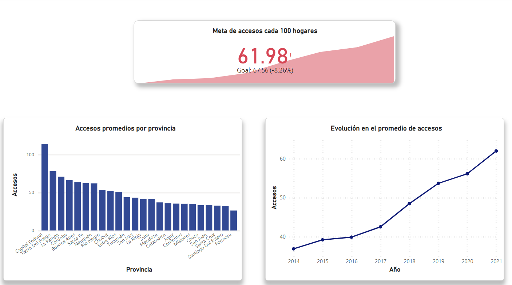
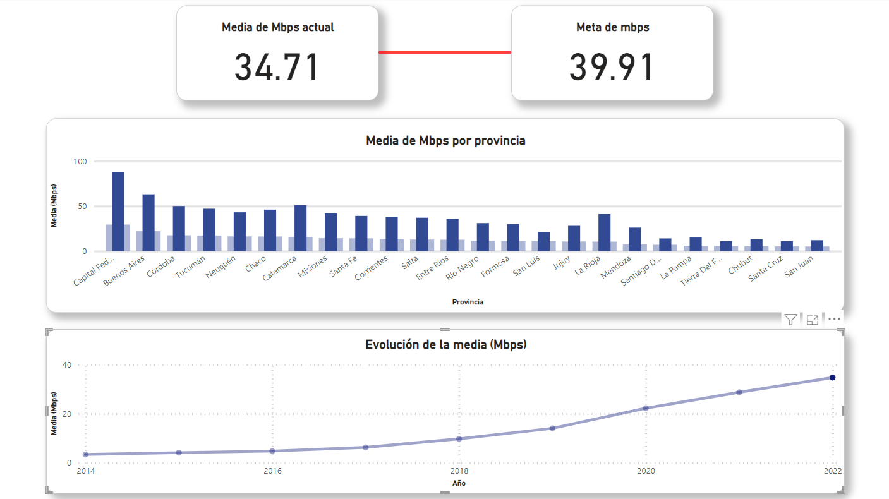
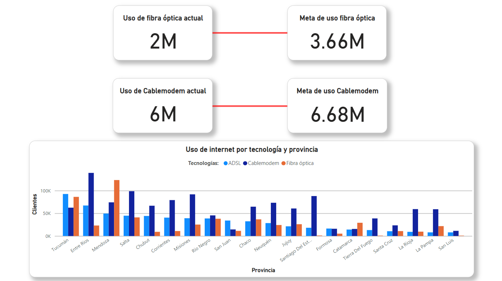
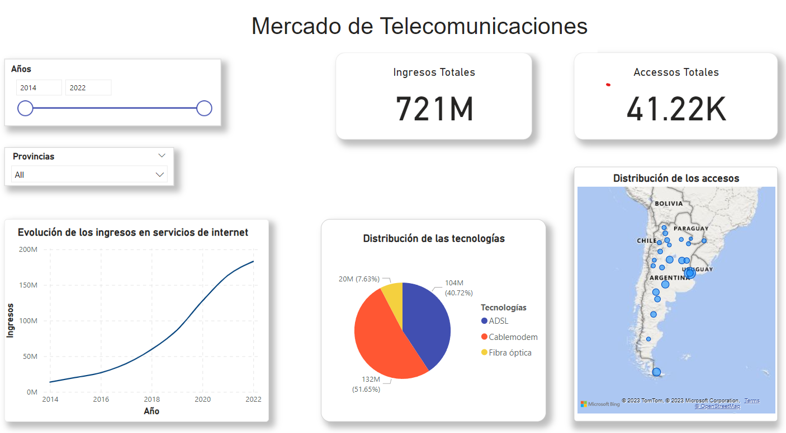

# <h1 align="center"> Proyecto de Data Analytics </h1>  

# Introducción

Este proyecto se enfoca en el análisis del sector de telecomunicaciones en Argentina, basandosé principalmente en el crecimiento, ingresos y evolución de los servicios de internet con el paso de los años. Se utilizarán datos oficiales obtenidos del ENACOM para analizar la evolución del sector en variables como el accesso a internet por provincias, generación de ingresos nacionales, distribución de las tecnologías en el país, entre otras. 
Tomaremos el rol de un análista al cual se le pide que describa el comportamiento del sector para ayudar a mejorar la prestación de servicios de la empresa que lo 
contrato, realizando un análisis con los datos para posteriormente definir un plan de acción (KPIs) y realizar la presentación de un Dashboard que reuna las 
conclusiones obtenidas. 
 
 
# EDA (Exploratoy Data Analysis)  

 
Se llevo a cabo el procesamiento, limpieza y análisis de las variables presentes en nuestros datos en busca de patrones, tendencias, relaciones y anomalías dando
lugar a información útil para la generación de gráficos y posteriores conclusiones para la realización del proyecto. En el [archivo EDA](https://github.com/germo24/PI_Visualizaciones/blob/main/EDA.ipynb) podrás observar una serie de transformaciones, la realización de gráficos en busca de información, análisis sobre los mismos y las conclusiones de mercado que se podrían tomar en base a lo observado. Con las conclusiones se plantearon luego 3 **KPIs 
(Key Performance Indicator)** con los que se buscará proporcionar una medida cuantificable y objetiva del rendimiento del negocio:  

 

  **1 - Aumentar en un 9% el accesso cada 100 hogares a nivel nacional en el próximo año.**
  
 

  

 Hemos establecido como objetivo aumentar en un 9% la media general de accesos cada 100 hogares en el lapso de un año, es un objetivo alcanzable debido que el crecimiento anual de esta variable ronda el 6%. Realizamos 2 gráficos en los que podemos ver la media de accesos por provincia y la evolución de los accesos en el tiempo. También, podremos observar un campo con la meta de accesos a alcanzar que varía según el objetivo que se fije.  
  
  
  **2- Aumentar la velocidad media (Mbps) un 15% a nivel nacional en el próximo año.** 

 

  

Observamos que la velocidad media de bajada (Mbps) a nivel nacional es bastante baja y que el panorama es incluso peor si se analiza a nivel provincial, teniendo 
una distribución desigual, contando con 4 provincias que sesgan o suben considerablemente la media general. Viendo esto, nos hemos propuesto subir la velocidad media de bajada en un 15% a nivel nacional, centrandonós principalmente en las zonas que cuenten con amplías poblaciones y velocidades reducidas. Se realizaron 
gráficos para describir tanto la velocidad media de bajada a nivel provincial como su evolución en el tiempo, incluyendo también las métrica sobre la velocidad media actual y la meta que se debe alcanzar el siguiente año.   

   
  
  **3- Aumentar la cantidad de clientes de fibra óptica en un 65% y 10% en Cablemodem a nivel nacional en el período de un año, quitando cuota de mercado a 
  tecnologías obsoletas como ADSL.** 

   

  

A través del análisis, hemos encontrado que en distintas provincias sigue existiendo un alto uso de tecnologías obsoletas con capacidades de velocidad y transmisión
de datos baja. Por esto, nos hemos planteado reducir el uso de estas, mejorando las velocidades y el uso de internet general, ofreciendo sobre todo en zonas
con alto uso de tecnologías ADSL la prestación de servicios de Cablemodem y Fibra óptica, buscando aumentar su uso a nivel nacional en un 65% y 10% respectivamente.
Se generó un gráfico con el uso de las tecnologías por provincia, exceptuando aquellas más desarrolladas para facilitar la visualización de nuestro mercado objetivo. Además, tenemos 2 elementos que nos indican la cantidad de clientes que utilizan cada una de las tecnologías y la meta que se ha propuesto alcanzar.  
 

# Dashboard

  

  

Se realizó un Dashboard dinámico en el que se caracterizan variables generales del mercado de internet y 3 segmentos que contienen las KPIs con visualizaciones seleccionadas para su entendimiento, medición y progreso actual. Pueden encontrarlo en el archivo [Telecomunicaciones_dashboard](https://github.com/germo24/PI_Visualizaciones/blob/main/Telecomunicaciones_dashboard.pbix).

 
  

 

# Fuentes de Datos

 [Página oficial del ENACOM](https://datosabiertos.enacom.gob.ar/home)  
 [Datasets utilizados](https://github.com/germo24/PI_Visualizaciones/tree/main/_src/Dataset/Originales) 

# Disclaimer
De parte del equipo de Henry se quiere aclarar y remarcar que los fines de los proyectos propuestos son exclusivamente pedagógicos, con el objetivo de realizar
proyectos que simulen un entorno laboral, en el cual se trabajen diversas temáticas ajustadas a la realidad. No reflejan necesariamente la filosofía y valores
de la organización. Además, Henry no alienta ni tampoco recomienda a los alumnos y/o cualquier persona leyendo los repositorios (y entregas de proyectos) que 
tomen acciones en base a los datos que pudieran o no haber recabado. Toda la información expuesta y resultados obtenidos en los proyectos nunca deben ser tomados 
en cuenta para la toma real de decisiones (especialmente en la temática de finanzas, salud, política, etc.).  

 

*Autor Germán Voss*
